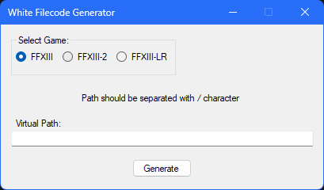

# WhiteFilecodeGenerator
 
  
This small program allows you to generate filecodes for files stored in the white_img archive files from the FINAL FANTASY XIII trilogy.

## Important
- You can generate filecodes only for these following directories and files:

  | Directories | File Types | 
  | --- | --- |
  | chr | .trb, .imgb and .mpk files |
  | event | .xwb, .bin and .imgb files |
  | gui/resident/autoclip | .imgb and .xgr files |
  | gui/resident/clipbg | .imgb and .xgr files |
  | gui/resident/monster | .imgb and .xgr files |
  | gui/resident/mission | .imgb and .xgr files |
  | gui/resident/tutorial | .imgb and .xgr files |
  | mot | .bin files |
  | sound/pack | .scd and .wpd files |
  | txtres/ac | .ztr files |
  | txtres/event | .ztr files |
  | txtres/zone | .ztr files |
  | vfx/chr | .imgb and .xfv files |
  | zone/z### | .wdb and .clb files |

- Some filepaths require numerical ids to be specified and these numerical ids will be documented and linked here shortly. 
